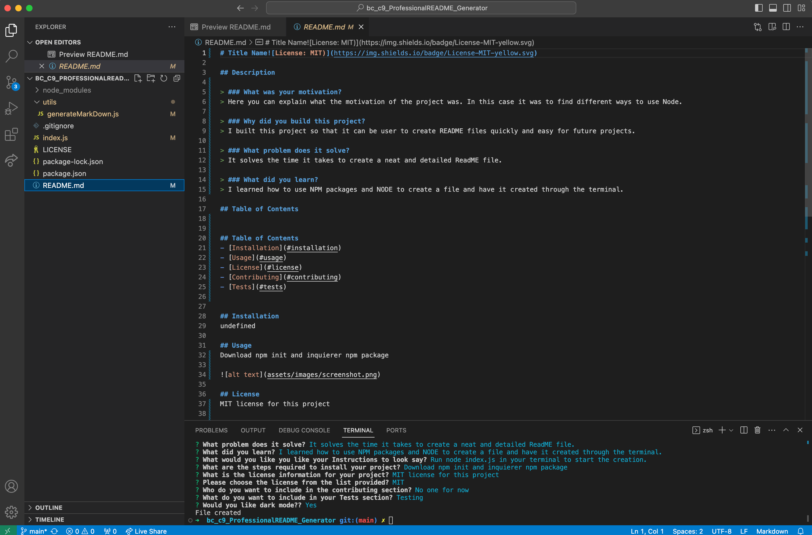

# Title Project
    
## Description

> ### What was your motivation?
> Motivation of this project was to learn how to use Node and create files.

> ### Why did you build this project?
> To have a README generator tool that can quickly organize a professional lay out README.

> ### What problem does it solve?
> It makes created a README file quick and easy.

> ### What did you learn?
> I learned how to use Node and download npm packages like inquierer and use them in the project.
  
## Table of Contents

## Table of Contents
- [Installation](#installation)
- [Usage](#usage)
- [License](#license)
- [Contributing](#contributing)
- [Tests](#tests)

## Installation
undefined

## Usage
There are no specific steps for this generator.

## License
MIT License Info.

## Badges

## Contributing
No one at the moment.

## Tests
Rodolfo Espinosa Nunez